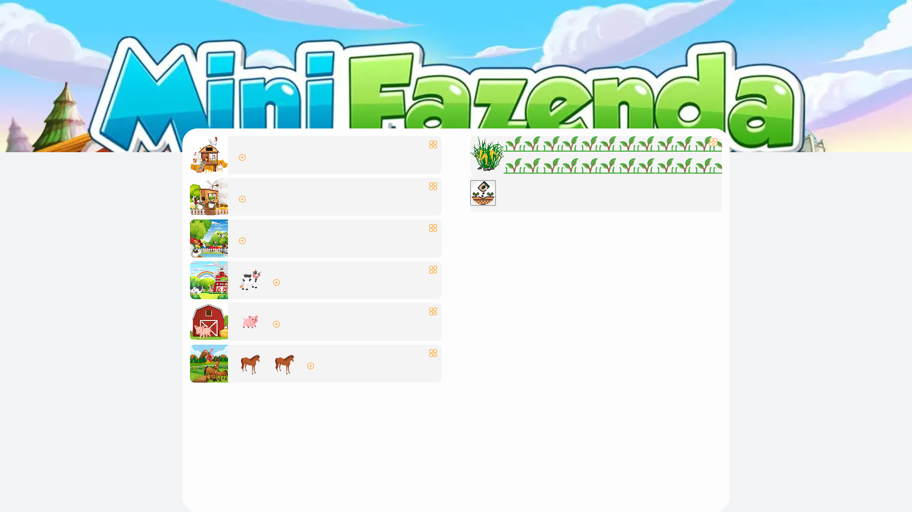
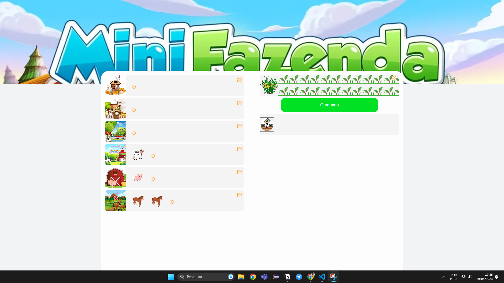
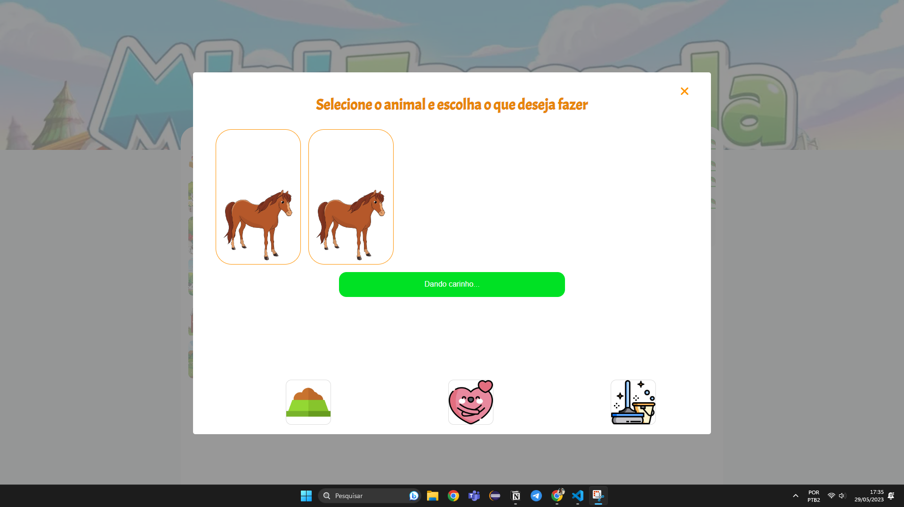
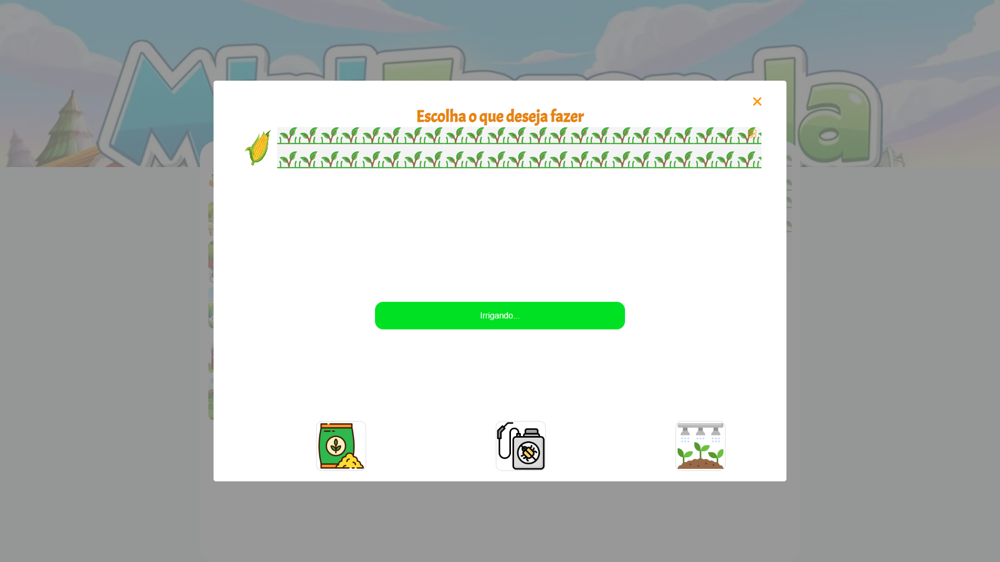

# Fazendinha Barbosa

# Objetivo

Desenvolver um aplicativo web de uma “fazendinha” implementando os padrões de projetos estudados em sala na disciplina de POO/UFAL.

Utilizaremos o framework React junto com Typescript.

# Visão Geral

A princípio pensamos em criar as seguintes áreas:

- Plantação:
    - Terrenos com plantações de macaxeira, milho, inhame, arroz, batata, etc.
- Animais:
    - Vários locais com seus respectivos animais: galinha, porco, vaca, ovelha, etc.
- Ações para cuidar das plantas:
    - Ações: plantar, colher, irrigar, adubar, combater pragas.
- Ações para cuidar dos animais.
    - Ações: alimentar, adicionar novo animal, abater, limpar o local onde eles vivem.

Será possível também desfazer ações e visualizar um histórico das que já foram feitas.

# Padrões de Projeto

A ideia é aplicar os seguintes padrões de projeto:

- Template Method: usado para as etapas do processo de plantação.
- Factory Method: responsável por criar novos animais.
- Strategy pattern: qual método vou utilizar para cuidar das plantas ou cuidar dos animais.
- Command e Memento: ações de desfazer e visualizar o histórico.

# Atualização - 22/11
### Aprimoramentos no desing do projeto:

### Diagrama UML:

### Para Executar o projeto:
- Clone o repositório
- Execute o comando 'yarn' para instalar as dependências
- Execute o comando 'yarn dev' para rodar o projeto 
